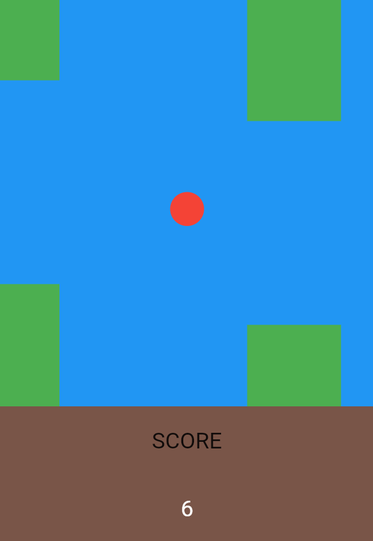
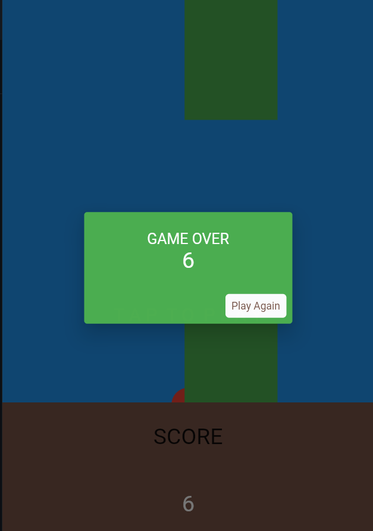

# ``FlappyBall with Flutter``

A simple Flappy Bird clone using Flutter, that has a Ball instead of Bird.

`Screenshots :`

Initial Picture of Tap to Play

Playing Screenshot

Game Over Screenshot

